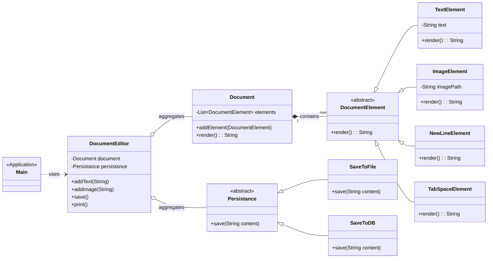

## Design a Document Editor Tool like Google Docs

### Basic Design

Start with some simple features:
- Elements: Document stores some elements like text and images
- Render: Document can render its element in formated structure
- Print Document: Print rendered doc in a file

Classes
```
|-----------------------------------------
|   Document
|-----------------------------------------
|   elements: String[]
|-----------------------------------------
|   addText(text: string): void
|   addImage(imagePath: String): void
|   renderDocument(): String
|   printDocument(): void
|-----------------------------------------
```

This above design has many problems:
1. SRP: Single class responsible for many things like addText, addImage, renderDocument, printDocument.
2. OCP: To add new element we need to make changes in DocumentEditor class.
3. Don't have LSP, ISP, DIP principles.

### Improvements

1. Create a DocumentElement class to support the OCP for elements
2. Create Document class that will add, remove, render elements on the document 
3. Persistance class to abstract save file logic (like saveToPDF, saveToDB, ...etc)


---------------------


### Problem Statement

Design a simple, extensible document editor, similar to a basic version of Google Docs. The editor should allow a user to compose a document by adding various types of elements.

**Core Requirements:**

*   **Document Composition:** The system must allow the creation of a document by adding elements sequentially.
*   **Element Types:** Initially, it should support basic elements like `Text`, `Image`, `NewLine`, and `TabSpace`.
*   **Extensibility:** The design must be flexible enough to easily add new element types (e.g., `Table`, `Header`) in the future without modifying the core document structure.
*   **Rendering:** The document should be renderable into a single formatted string representation.
*   **Persistence:** The rendered document content must be persistable through various mechanisms, such as saving to a local file or a database. The system should be open to adding new persistence methods.

### Entities and Class Design

The solution is broken down into several key components, each with a distinct responsibility, following the principles of good object-oriented design.

*   **`DocumentEditor`**:
    *   Acts as a high-level **Facade** for the client (`Main` class).
    *   It simplifies the interaction with the document system by providing a clean API (`addText`, `addImage`, `save`, etc.).
    *   It coordinates the `Document` and `Persistance` objects but doesn't contain business logic for rendering or saving.

*   **`Document`**:
    *   Represents the document itself.
    *   It holds an ordered list of `DocumentElement` objects.
    *   Its primary responsibility is to manage this collection of elements and to orchestrate the rendering process by iterating through the elements and calling their individual `render` methods.

*   **`DocumentElement` (Abstract Class)**:
    *   Defines the common interface for all elements that can be part of a document.
    *   It declares an abstract `render()` method, forcing all concrete subclasses to provide their own rendering logic.
    *   This is the cornerstone of making the document extensible for new element types.
    *   **Concrete Elements**: `TextElement`, `ImageElement`, `NewLineElement`, `TabSpaceElement`.

*   **`Persistance` (Abstract Class)**:
    *   Defines the contract for saving content, acting as the **Strategy** interface in the Strategy Design Pattern.
    *   It declares an abstract `save(String content)` method.
    *   This abstraction allows the `DocumentEditor` to be decoupled from the specific details of how a document is saved.
    *   **Concrete Strategies**: `SaveToFile`, `SaveToDB`.

### UML Diagram

Here is a UML diagram representing the relationships between the classes:




## SOLID Principles Application
The design effectively utilizes SOLID principles to create a robust and maintainable system.

* S - Single Responsibility Principle (SRP):
    * Document: Responsible only for managing a list of elements and orchestrating the render.
    * DocumentElement subclasses: Each element (e.g., TextElement) is only responsible for its own content and how it's rendered.
    * Persistance subclasses: Each class (e.g., SaveToFile) is only responsible for a single way of saving data.

    * DocumentEditor: Its single responsibility is to provide a simple API to the client, delegating tasks to other objects.


* O - Open/Closed Principle (OCP):
    * The system is open for extension but closed for modification.
    * New Elements: We can add a new element (e.g., TableElement) by creating a new class that extends DocumentElement without changing the Document or DocumentEditor classes.
    * New Persistence Methods: We can add a new saving mechanism (e.g., SaveToCloud) by creating a new class that extends Persistance without changing the DocumentEditor.

* L - Liskov Substitution Principle (LSP):
    * Any subclass of DocumentElement (like TextElement or ImageElement) can be used wherever a DocumentElement is expected. The Document class's render method works correctly with any DocumentElement subclass.
    * Similarly, any Persistance subclass can be passed to the DocumentEditor.


* I - Interface Segregation Principle (ISP):
    * The DocumentElement and Persistance abstractions are small and focused. Clients only depend on the methods they need. For example, Document only needs the render() method from DocumentElement.

* D - Dependency Inversion Principle (DIP):
    * High-level modules do not depend on low-level modules; both depend on abstractions.
    * DocumentEditor (high-level) depends on the Persistance abstraction, not on concrete SaveToFile or SaveToDB (low-level).
    * Document (high-level) depends on the DocumentElement abstraction, not on concrete TextElement or ImageElement (low-level).


## Future Improvements
While the current design is solid, here are some areas for future enhancement:
* Element Factory: The DocumentEditor currently creates concrete element instances (new TextElement(), new ImageElement()). This violates DIP slightly. We could introduce a DocumentElementFactory to decouple DocumentEditor from concrete element classes, further improving OCP.
* State and Undo/Redo: The current design doesn't support editing or tracking document history. Implementing the Command pattern for actions (like AddElementCommand) and the Memento pattern to save/restore the document's state would be a great next step.
* Complex Rendering: The current render() method just returns a string. For a real-world application, we might need a more sophisticated rendering mechanism. A Visitor pattern could be used where different visitors (HTMLVisitor, MarkdownVisitor) could traverse the document elements and generate different output formats.
* Error Handling: The SaveToFile class has basic exception handling. A more robust, centralized error handling and logging strategy could be implemented across the application.